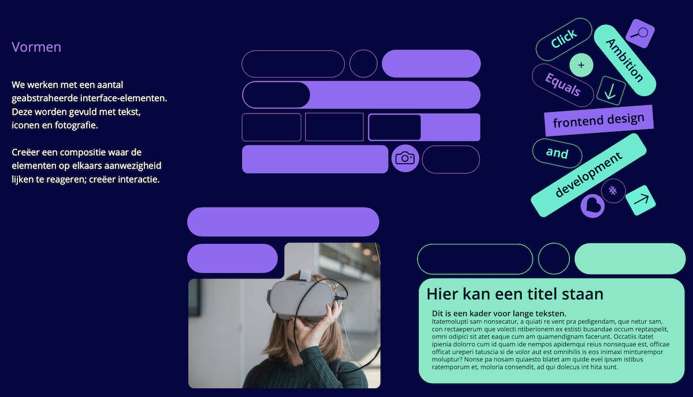
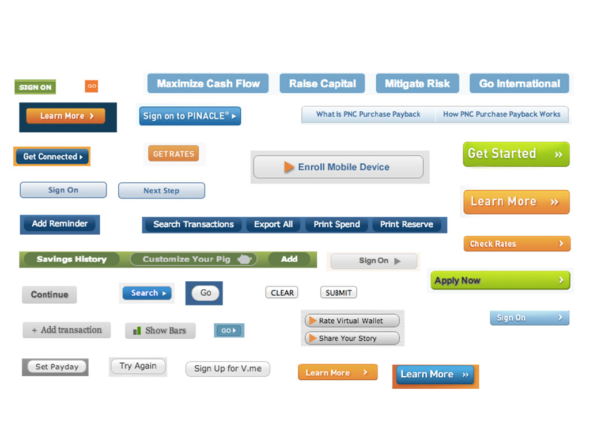

# Look and Feel - Corporate Identity

## Styleguide

Ontwerp en maak op basis van de huisstijl een *styleguide* voor een opdrachtgever.

<!-- 
DOEL: Die maandag wil je ze in Figma dingen laten doen toch?
Dat is/wordt de styleguide workshop 

Inventory
Template/sjabloon 'invullen' 
Dus als er iets niet is moet je dit zelf gaan bedenken en vormgeven

Styleguide: Figma file met onderdelen van componenten
De HTML voor de componenten, met CSS classes, custom props of anders...
Uiteindelijk: 1 stylesheet in een gezamenlijke repo die studenten met dezelfde opdrachtgever gebruiken in hun eigen project

Template in FIGMA voor de styleguide
8 artbooards en de bijhordende HTML klaarzetten in de leertaak. Styleguide.html. 
Studenten gaan zelf een stylesheet maken. 
Deze komt op 1 plek te staan

Maak een nieuwe page, noem deze "styleguide"
Maak/vul frame/artboard (form, typo, kleur, afbeeldingen, ....)
Daarbinnen components

-->

### Huisstijl

Een huisstijl is de visuele identiteit van een organisatie. Het symbolische gedeelte van de bedrijfsidentiteit.
Hieronder vallen naam, beeldmerk, kleuren, typografie (lettertype), vormentaal (stramienen/vlakken/curves/opmaak) en fotografiestijl.

*De huisstijl van FDND bestaat uit verschillende kleuren, vormen, typografie en gebruik van beeldmateriaal.*

Waarom heeft een bedrijf/instelling/organisatie een huisstijl nodig?
Het zorgt voor herkenbaarheid en het geeft de gebruiker een ervaring. Het laat zien wat de gebruiker/bezoeker kan verwachten. Als de visuele eigenschappen van een identiteit consistent worden vormgegeven, onstaat er vertrouwen bij de gebruiker.

### Huisstijlen toepassen met behulp van een Styleguide

Een frontender moet in staat zijn om een huisstijl goed toe te passen. Om dit te bereiken, moet je eerst een huisstijl analyseren: Wat zijn de eigenschappen van de huisstijl en hoe hebben ze vorm gekregen? Hoe gedragen deze eigenschappen zich? Wat is het idee erachter?

Een styleguide is essentieel voor het begrijpen en toepassen van een huisstijl. Een styleguide geeft voorbeelden en uitleg over hoe iets eruit moet zien. Een styleguide helpt bij het ontwerpen en bouwen van een website, zodat de verschillende elementen consistent worden toegepast.

*In de styleguide van FDND staat uitgelegd hoe de vormen en kleuren moeten worden toegepast.*

> Style guides are an important tool for web development today, especially in large, complex web applications. They help document styles and patterns, keep designers and developers in sync, and greatly help to organize and distill complex interfaces. ([Lambert, 2016](https://www.smashingmagazine.com/2016/05/creating-a-living-style-guide-case-study/))

## Aanpak

### Interface inventory

Je begint met het in kaart brengen van alle onderdelen van de huisstijl en gemaakte websites. Het resultaat is een *interface inventory*, een verzameling van alle gemaakte interface elementen zoals typografie, images, media, buttons en andere formulier elementen.
 
 1. Jullie gaan met de studenten die dezelfde opdracht hebben de onderdelen van de huisstijl verzamelen in het Figma document van de opdrachtgever.
 2. Kopieer de artboards van de [Interface Inventory template](https://www.figma.com/design/Tox75iooqru0EvV3iLbkHw/Interface-Inventory?node-id=0-1&node-type=canvas&t=sZLKnogq564gwWdl-0) naar jullie Figma document. 
 3. Maak per categorie van de Interface Inventory screenshots van die onderdelen op de door jullie gemaakte websites (het kan zijn dat niet alle categorieën voorkomen)
 4. Doe hetzelfde per categorie met het aangeleverde ontwerp van de opdrachtgever
 5. Doe hetzelfde per categorie met de door jullie gemaakte Figma ontwerpen
 6. Bespreek de interface inventory met een mento, zodat jullie een goed beeld krijgen van de verschillende onderdelen die in gebruik zijn.

*Voorbeeld van een Interface inventory van alle buttons die gebruikt worden op een bank website.*

<!--
#### interface inventory template

- Typography
    - Headings: headings, titels, subtitles, ...
    - Text elements: paragraphs, blockquotes, ...
    - Lists: bulleted, numbered, definition, ...
- Images
    - Logo's
    - Icons
    - Content images: different content images with borders, white space, ...
    - Image with captions
- Media
    - Video player
    - Audio player
    - Slideshow players
- Tables 
- Buttons
- Forms
    - Text inputs: text, email, url, password, ...
    - Select menu's
    - Radio/Checkbox Inputs
- Navigation
    - Primary Navigation
    - Tabs
    - Breadcrumbs
- Components
    - Carousels
    - Accordions
- ...
-->

### Styleguide samenstellen

Nu je een inventarisatie hebt gemaakt van alle onderdelen kunnen jullie een styleguide maken. 
Bepaal voor de basiselementen kleur, typografie en formulier onderdelen hoe die eruit moeten zien en maak daar een gezamenlijke stylesheet voor, door deze stappen te volgen:

1. Bespreek het verzamelde materiaal uit de _interface inventory_ en onderzoek of je overeenkomsten kunt ontdekken tussen de verschillende huisstijl onderdelen.
2. Kopieer de artboards van de [Styleguide](https://www.figma.com/design/Tox75iooqru0EvV3iLbkHw/Interface-Inventory?node-id=0-1&node-type=canvas&t=sZLKnogq564gwWdl-0) naar jullie Figma document. 
3. Maak een ontwerp voor de verschillende huisstijl onderdelen: 
- Bepaal de verschillende kleuren voor de huisstijl in RGB of HSL formaat en maak een voorbeeld
- Bepaal alle typografische elementen zoals headings, text, links, lijsten en/of tabellen en maak voorbeelden. 
- Bepaal de formulier elementen zoals buttons, inputs, selects en radio's

### Gedeelde Stylesheet maken

Op basis van de styleguide gaan jullie een gezamenlijke stylesheet maken. 
Jullie gaan als team 1 stylesheet maken met de basis elementen van de huisstijl zoals de kleuren, typografie en formulier elementen.
Zo zorg je ervoor dat op verschillende websites de huisstijl consistent wordt toegepast.

1. Slechts één teamlid forkt de repo 'Look and Feel - Styleguide' voor deze opdracht. Deze persoon voegt de teamleden toe als 'Collaborators': Ga naar de settings van de repository, klik op collaborators en voeg de GitHub accounts van de overige teamleden toe.
2. Nu kunnen alle teamleden samenwerken op die repository, door deze allemaal te clonen (downloaden). Alle teamleden kunnen nu op hun eigen computer onderdelen van de website coderen, en hun aanpassingen en wijzigingen committen en pushen naar jullie gezamenlijke repository. 
3. Hernoem het CSS file `projectnaam.css` naar jouw opdrachtgever (`red-pers.css`, `dda.css`, etc.). Hier gaan jullie de CSS schrijven voor de huisstijl. Het begin van de HTML krijgen jullie van ons.
4. Ontwerp en maak de CSS voor de huisstijl onderdelen, overleg met het team hoe jullie de CSS classes gaan noemen. Schrijf de afspraken over bijvoorbeeld classnames en code conventies op het whiteboard.
5. Zet de gezamenlijke stylesheet live door de repo te publiceren met GitHub pages. 
6. Gebruik de gezamenlijke stylesheet in je eigen project en pas je code aan, zodat je de nieuwe classes gebruikt. Jouw CSS zal kleiner worden, omdat een deel al in de gezamenlijke stylesheet staat.
7. Zorg dat jullie veranderingen in de styleguide bijhouden met issues, zodat iemand uit het team het kan aanpassen. 

### Bronnen

- https://github.com/fdnd-task/look-and-feel-styleguide

- [What is a style guide and how to create one?](https://www.figma.com/resource-library/what-is-a-style-guide/)
- [Interface Inventory](https://bradfrost.com/blog/post/interface-inventory/)

Voorbeelden van een Styleguides:
- [Decathlon Design System](https://www.decathlon.design/726f8c765/p/75e137-digital-overview) 
- [Familysearch Styleguide](https://www.familysearch.org/frontier/styleguide/)