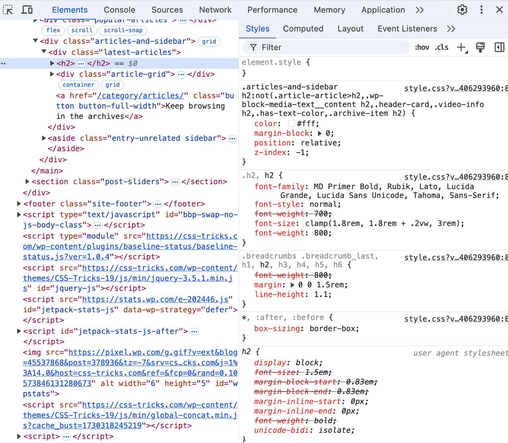
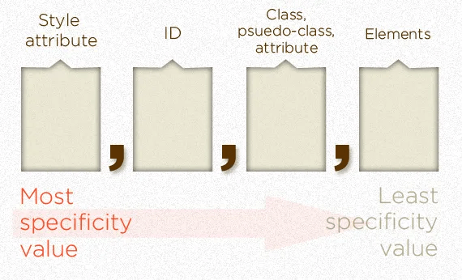

# Look and Feel - Corporate Identity

## Stylesheet

Je hebt na de Sprint Planning in Figma een styleguide gemaakt en een gezamenlijke stylesheet met de huisstijl van de opdrachtgever. 

Vandaag ga je leren hoe je een gestructureerd CSS file kan maken met _classes_ en _Custom Properties_. 

### Aanpak

Eerst ga je analyseren wat voor CSS strategie grote websites gebruiken. Daarna ga je met behulp van Custom Properties jullie gezamenlijke stylesheet structuren. Tot slot ga je het gezamenlijke stylesheet inladen en leren hoe je de styles kan toepassen op je project. 


## CSS strategie
Naarmate er meer CSS in je project komt, bijvoorbeeld als je gaat samenwerken aan een project, wordt het steeds belangrijker om een CSS strategie (met elkaar) te bepalen.

### Opdracht
Onderzoek op 3 verschillende websites hoe CSS is toegepast voor een `h2` en `button` element. 


*Met behulp van de Devtools kun je onderzoeken wat de CSS strategie van een website is.*

#### Beantwoord deze vragen op het whiteboard:
- Welke element-selectoren en class-selectoren zijn gebruikt?
- Welke properties staan er in welke selectoren?
- Wat valt op aan de naamgeving van classes en eventuele custom properties?

#### Onderzoek deze websites:  
- https://css-tricks.com/  
- https://www.smashingmagazine.com/  
- https://fdnd.nl/


## Custom Properties
Met Custom Properties kun je zelf een CSS `property` bedenken, daar een `value` in bewaren, en die op meerdere plekken gebruiken. Hiermee zorg je voor _DRY code_, wat de code beter leesbaar, makkelijker onderhoudbaar en sneller maakt. Dit is fijn voor de developers én de gebruikers.

```css
.card {
  --spacing: 1.2rem;
  padding: var(--spacing);
  margin: var(--spacing);
}
```

Sterker nog, je kunt de waardes dynamisch aanpassen, en op die manier slimme styling schrijven, zoals:

```css
.button {
  --lightness: 30%;
  background: hsl(200 100% var(--lightness));

  &:hover, &:focus {
    --lightness: 25%;
  }
}
```

Veel tutorials gebruiken de `:root` selector (het hoogste element in de DOM; het `<html>` element bij een webpagina, het `<svg>` element bij een SVG bestand) om custom properties op te zetten. Door _inheritance_ in CSS zijn die properties in de hele onderliggende DOM bekend, maar custom properties zijn dus veel krachtiger dan alleen 'globale variabelen'. Je kunt hiermee snel verschillende stijlen voor bijvoorbeeld een knop maken:

```css
.button {
  --hue: 200;
  --lightness: 30%;
  background: hsl(var(--hue) 100% var(--lightness));
  color: #fff;

  &:hover, &:focus {
    --lightness: 25%;
  }

  &:active {
    --lightness: 20%;
  }
}

.button-ok {
  --hue: 100;
}

.button-cancel {
  --hue: 20;
}
```

Waarmee je bijvoorbeeld dit soort HTML kunt schrijven:

```html
<button class="button">Knop</button>
<button class="button button-ok">OK</button>
<button class="button button-cancel">Annuleren</button>
```

### Opdracht

Jullie hebben een gezamenlijke stylesheet gemaakt met de styling voor de kleuren, typografie en formulier elementen. 

Bekijk welke elementen in de gezamenlijke stylesheet geschreven kunnen worden met custom properties. Denk bijvoorbeeld aan kleuren, font-sizes, borders, breedtes en/of hoogtes van elementen. Als waardes vaker voorkomen, kun je custom properties gebruiken.

Bespreek met een mentor de custom properties, classnames en code conventies die jullie hebben toegepast. 
Schets het 'ontwerp' van jullie stylesheet op het whiteboard en noteer zo nodig aanpassingen over bijvoorbeeld classnames en code conventies.

### Bronnen

- [Using CSS custom properties (variables)](https://developer.mozilla.org/en-US/docs/Web/CSS/Using_CSS_custom_properties)
- [CSS Custom Properties Guide](https://css-tricks.com/a-complete-guide-to-custom-properties/)

<!-- - [Breaking CSS Custom Properties out of :root Might Be a Good Idea](https://css-tricks.com/breaking-css-custom-properties-out-of-root-might-be-a-good-idea/) -->


### Opdracht Light & Dark mode (advanced)
Als je al ervaring hebt met custom properties kun je proberen een Light & Dark mode te maken. Een Light & Dark mode op de website helpt gebruikers om de website beter te kunnen bekijken in verschillende omstandigheden.

Implementeer een Dark Theme op basis van custom properties die werkt op basis van de voorkeuren van de gebruiker. Custom properties kunnen hierbij helpen om onnodige herhaling van bijvoorbeeld CSS values voor kleuren te voorkomen. 

Gebruik het artikel [Dark Mode in CSS](https://css-tricks.com/dark-modes-with-css/). 

Voor nog meer tips en tricks kun je het artikel [Dark Mode in 3 Lines of CSS and Other Adventures](https://dev.to/madsstoumann/dark-mode-in-3-lines-of-css-and-other-adventures-1ljj) lezen. 


## CSS inladen
Nu je met je team een gezamenlijke stylesheet hebt gemaakt, kan je deze gebruiken in jouw eigen project. 
Voeg deze toe aan de `<head>` van je html document. 
Dan heb je dus twee CSS files gelinkt, dat ziet er dan zo uit. 

```html
<link rel="stylesheet" href="projectnaam.css">
<link rel="stylesheet" href="style.css">
```


### CSS principes
Maar welke styling wordt nu uitgevoerd als je `classes` gebruikt uit de huisstijl en uit je eigen stylesheet?

```html
    <h2 class="heading-red green">Welke kleur krijgt deze heading?<h2>
```

Voor het uitvoeren van CSS gebruikt de browser de CSS principes _Cascade_, _Specificity_, en _Inheritance_.
De _Cascade_ betekent dat de volgorde van de CSS bepalend is voor welke style wordt uitgevoerd.
_Specificity_ betekent dat een browser bepaalt welke styling het meest belangrijk is.
_Inheritance_ betekent dat (sommige) styles worden doorgegeven van _parent_ aan geneste-elementen.

### Cascade
De Cascade betekent dat de volgorde bepaalt hoe styles worden toegepast als er meerdere stijlen van toepassing zijn op een element.
"Cascade" betekent letterlijk "waterval". 
Het idee is dat stijlen in een bepaalde volgorde "vallen", dat bepaalt welke stijl het laatste is en dus wordt uitgevoerd.

### Specificity
Browsers berekenen welke style het belangrijkst is en wordt uitgevoerd. 
Een element selector is het minst specifiek en krijgt een _weight_ van `0 0 0 1`. 
Een class selector krijgt `0 0 1 0`. 
Een ID selector krijgt `0 1 0 0`. 
En een inline-style krijgt een _weight_ van `1 0 0 0`, die style krijgt dus voorang op de id-, class- en element-selectors. 

  
*Browsers berekenen welke styling belangrijk is. Hoe specifieker de styling hoe hoger de specificity.*

### Opdracht
Open je code editor en maak een blanco HTML pagina, noem het file `specificity.html` en sla deze op in de repo van je leertaak. 
Maak een leeg CSS file, noem het `specificity.css` en sla het op in dezelfde map als het HTML file. Voeg de gemeenschappelijke stylesheet toe aan het HTML file em daaronder het lege CSS file. 
Dat ziet er dan zo uit in de HTML: 

```html
<link rel="stylesheet" href="url-gezamenlijke-stylesheet.css">
<link rel="stylesheet" href="specificity.css">
```

#### Element selector

Maak een `<h2>` element aan in het HTML file en geef het een bijhorende class uit de gezamenlijke stijlesheet. Maak nog een `<h2>` element aan zonder class. Nu staat er zoiets in het HTML file: 

```html
<h2 class="heading-medium">Ik ben een heading, welke kleur krijg ik?</h2>
<h2>Ik ben ook een heading, welke kleur krijg ik?</h2>
```

Maak nu een element selector in het `specificity.css` met een andere kleur dan in de huisstijl staat. 

```css
h2{
    color: purple;
}
```

Welke kleur hebben de headings? 

#### Class selector

Voeg nog een `<h2>` element toe met een class uit de gezamenlijke stijlesheet en voeg een tweede class toe. 

```html
<h2 class="heading-medium test">Ik ben een heading met twee classes</h2>
```

Maak een class aan met dezelfde naam in `specificity.css` met een andere kleur.

```css
.test{
    color: green;
}
```
Welke kleur hebben de headings? 


#### Class volgorde

Voeg nu aan het `specificity.css` file een class toe met dezelfde naam als al in de gezamenlijke stylesheet staat, 
maar met een andere kleur dan in de huisstijl staat. 
Dat ziet er dan zo uit:

```css
.heading-medium{
    color: pink;
}
```
Welke kleur hebben de headings? 


#### ID selector

Voeg nog een `<h2>` element toe, geef het de class uit de gezamenlijke stijlesheet en voeg een ID toe

```html
<h2 class="heading-medium test" id="heading">Ik ben een heading met een ID</h2>
```

Maak een id selector in `specificity.css` met een andere kleur.

```css
#heading{
    color: yellow;
}
```
Welke kleur hebben de headings? 


<!-- Refactor jouw reeds bestaande lokale stylesheets. Hieruit kan alle overbodige CSS, die nu in de gemeenschappelijke stylesheet staat, worden verwijderd. -->

#### Bronnen
Als je meer wil leren over het principe Specificity van CSS kun je hier meer lezen: 

- [Cascade, specificity, and inheritance](https://developer.mozilla.org/en-US/docs/Learn/CSS/Building_blocks/Cascade_and_inheritance)
- [Specifics on CSS Specificity](https://css-tricks.com/specifics-on-css-specificity/)
